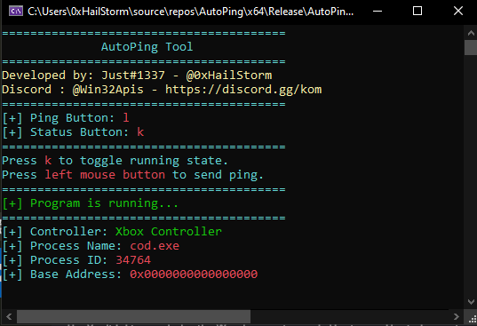

# AutoPing Tool for COD 20



## Table of Contents
- [Introduction](#introduction)
- [Features](#features)
- [Installation](#installation)
- [Usage](#usage)
- [Configuration](#configuration)
- [Technical Details](#technical-details)
- [License](#license)

## Introduction
AutoPing is a custom tool designed to automate ping actions in the game Call of Duty 20 (COD 20). This tool monitors the game's process and allows users to send ping commands with a mouse click. It also provides an easy-to-use interface to toggle the tool's running state and update settings dynamically.

## Features
- **Automated Ping Sending**: Send ping commands in COD 20 with a simple mouse click.
- **Configurable Keys**: Customize the ping and status keys through a JSON configuration file.
- **Process Monitoring**: Automatically detects and responds to the running state of COD 20.
- **Real-time Dashboard**: Displays the current status, including process information and running state, in the console.

## Installation
1. **Clone the Repository**:
    ```bash
    git clone https://github.com/yourusername/AutoPing.git
    cd AutoPing
    ```

2. **Compile the Source Code**:
    - Open the project in your preferred C++ development environment (e.g., Visual Studio).
    - Build the project to create the executable.

## Usage
1. **Run the Tool**:
    - Execute the compiled program. The console window will open and display the dashboard.

2. **Interacting with the Tool**:
    - Press the configured status button to toggle the running state.
    - Use the left mouse button to send ping commands while the tool is running.

## Configuration
The tool uses a JSON file named `config.json` to configure the ping and status buttons. If the file does not exist, a default configuration will be created.

### Default Configuration (`config.json`)
```json
{
    "ping_button": "x",
    "status_button": "R"
}
```

### Customizing Configuration
- Open `config.json` in a text editor.
- Modify the `ping_button` and `status_button` values to your desired keys.
- Save the file and restart the tool to apply the new settings.

## Technical Details
### Key Functions
- **createDefaultJSON**: Creates a default `config.json` file if it does not exist.
- **readButtonsFromJSON**: Reads the ping and status buttons from the `config.json` file.
- **SendKey**: Sends a keyboard input using the Windows `SendInput` function.
- **isProcessRunning**: Checks if the COD 20 process is running and gathers its information.
- **printDashboard**: Displays the tool's dashboard in the console.
- **SetConsoleWindowSize**: Sets the size of the console window.

### Process Monitoring
The tool continuously checks if the COD 20 process (`cod.exe`) is running. If the process starts or stops, the dashboard updates to reflect the current state.

### Sending Keys
The tool uses the `SendInput` function to simulate key presses. This ensures that the ping command is sent accurately within the game.

### Console Display
The tool uses Windows API functions to set console text colors and adjust the window size for a clear and informative dashboard.

## License
This project is licensed under the MIT License. See the [LICENSE](LICENSE) file for details.
